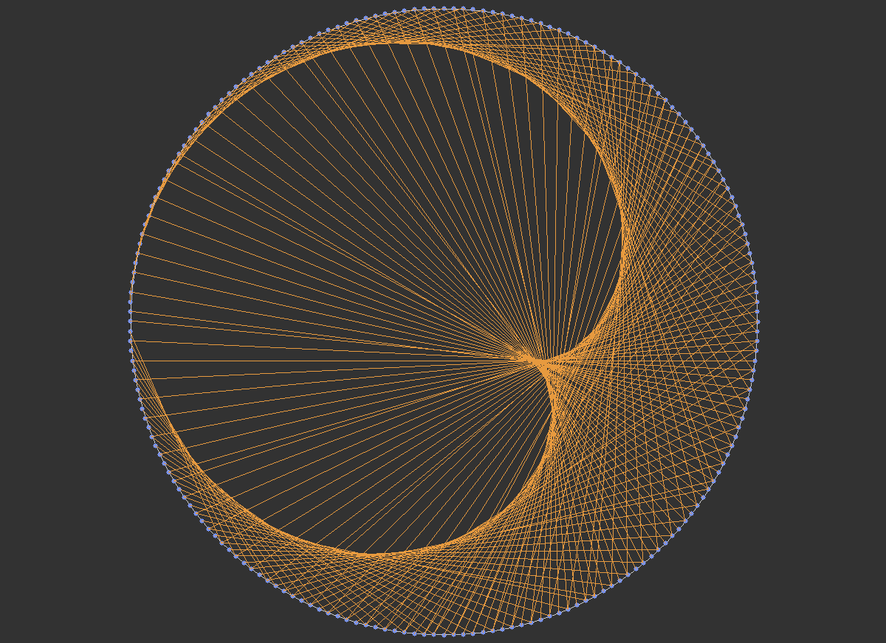
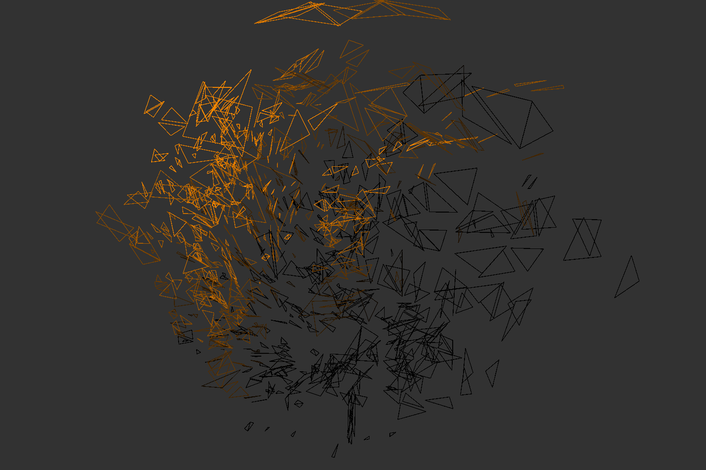
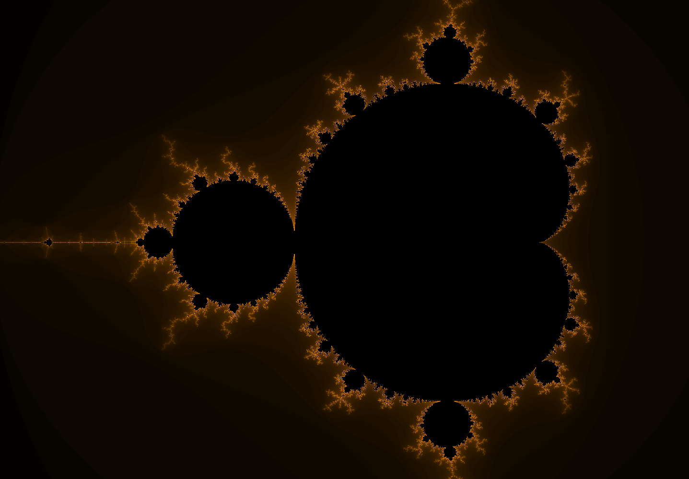

## About
General purpose library focused on 3D graphics.  
Goal is to *simplify* use of C++, Win32 and DirectX.  

## D3D11 Triangle Hello World
```cpp
#include "klibrary.h"

static const char* SHADER_SOURCE =
R"(
// Vertex shader
float4 v_shader(const float3 position : KL_Position) : SV_Position
{
    return float4(position, 1.0f);
}

// Pixel shader
float4 p_shader(const float4 screen_position : SV_Position) : SV_Target
{
    return float4(1.0f, 0.75f, 0.35f, 1.0f);
}
)";

int main()
{
    // Window setup
    kl::Window window = { "Hello World!", { 1600, 900 } };
    kl::GPU gpu = { static_cast<HWND>(window) };

    // Window resize setup
    window.on_resize.emplace_back([&](const kl::Int2 new_size)
    {
        if (new_size.x > 0 && new_size.y > 0) {
            gpu.resize_internal(new_size);
            gpu.set_viewport_size(new_size);
        }
    });
    window.maximize();

    // Fullscreen setup
    window.keyboard.f11.on_press.emplace_back([&]
    {
        const bool new_state = !window.in_fullscreen();
        window.set_fullscreen(new_state);
        gpu.set_fullscreen(new_state);
    });

    // Mesh setup
    const kl::dx::Buffer triangle = gpu.create_vertex_buffer({
        { {  0.0f,  0.5f, 0.5f } },
        { { -0.5f, -0.5f, 0.5f } },
        { {  0.5f, -0.5f, 0.5f } },
    });
    
    // Shader setup
    const kl::RenderShaders shaders = gpu.create_render_shaders(SHADER_SOURCE);
    gpu.bind_render_shaders(shaders);

    // CDS (Clear-Draw-Swap)
    while (window.process(false)) {
        gpu.clear_internal(kl::colors::GRAY);
        gpu.draw(triangle);
        gpu.swap_buffers(true);
    }
    return 0;
}
```

## Win32 Examples
### Visualising sorting algorithms  


### Visualising times table  


## DirectX Examples
### Usage of geometry shaders  


### Rendering the Mandelbrot set  

